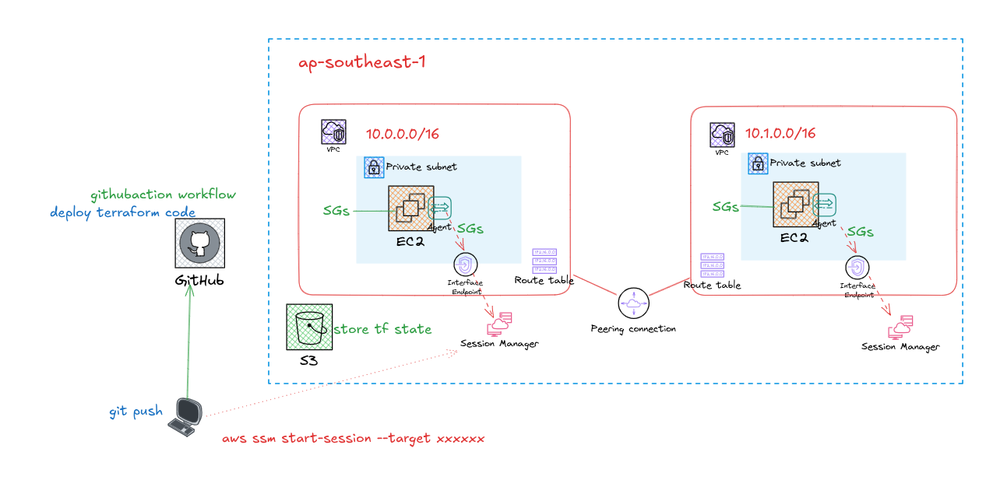

# AWS 2-VPC Infrastructure with GitHub OIDC + Terraform

## Overview

This project provisions a secure AWS infrastructure using:

- Terraform Infrastructure as Code (IaC)
- GitHub Actions CI/CD
- OIDC authentication from GitHub to AWS
- AWS Systems Manager (SSM) Session Manager
- Private EC2 instances
- VPC Peering
- Remote Terraform state in S3

The architecture follows modern cloud security best practices:
- No long-lived AWS credentials
- No public EC2 instances
- No SSH access
- Least privilege IAM access
- Automated deployments via GitHub Actions

---

# Architecture

## Components

### AWS Region
- `ap-southeast-1`

### Networking
- VPC 1: `10.0.0.0/16`
- VPC 2: `10.1.0.0/16`
- Private subnets only
- VPC Peering connection

### Compute
- EC2 instances in private subnets
- SSM Agent enabled

### Access
- AWS Session Manager
- Interface VPC Endpoints:
  - SSM
  - EC2 Messages
  - SSM Messages

### CI/CD
- GitHub Actions
- OIDC federation with AWS IAM Role

### State Management
- S3 backend for Terraform state

---

# Features

- Secure GitHub OIDC authentication
- Fully automated Terraform deployment
- Remote Terraform state storage
- Private EC2 management through SSM
- Cross-VPC private communication
- Zero public SSH exposure
- Infrastructure as Code

---
